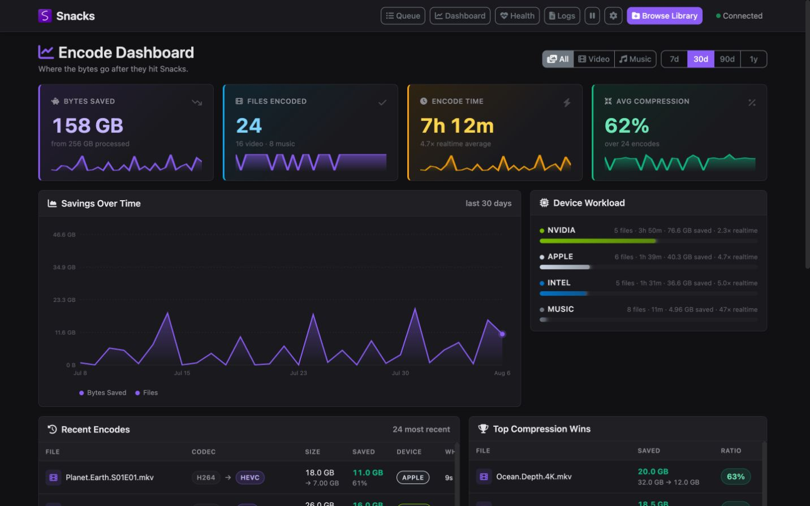
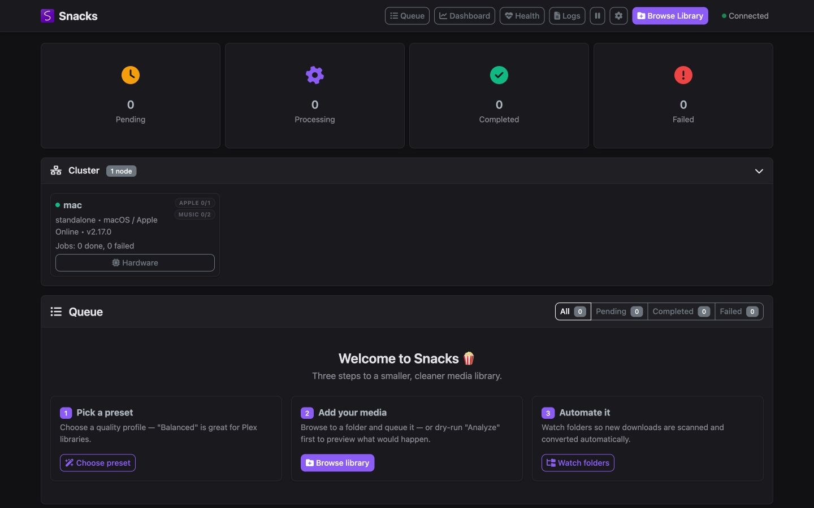
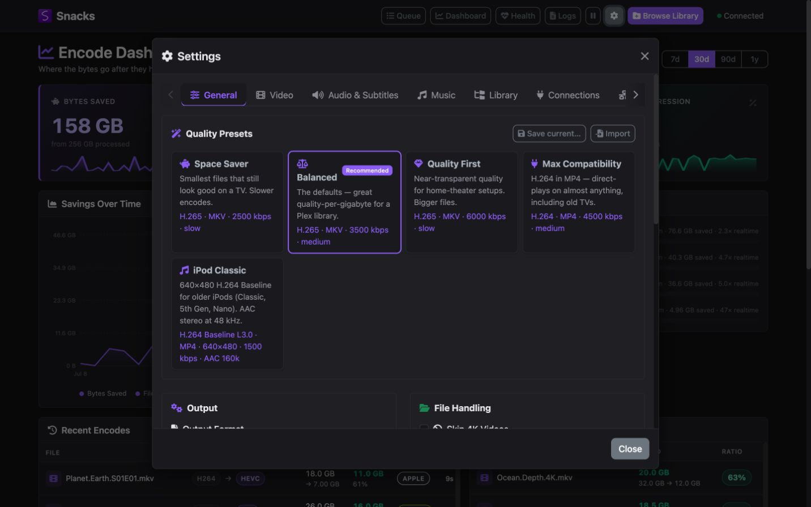
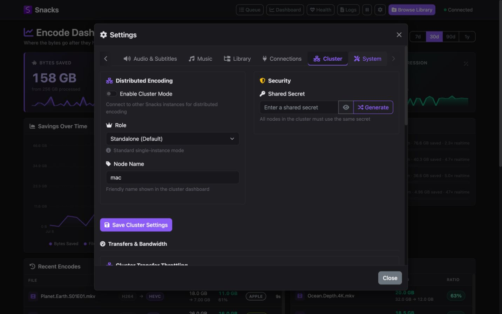
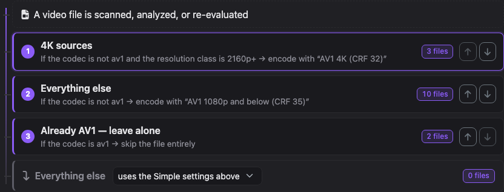
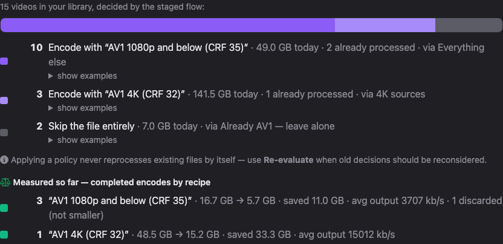

<p align="center">
  <a href="https://snacksvideo.com/">
    
  </a>
</p>

<h1 align="center">Snacks</h1>

<p align="center"><strong>Locally hosted. Lightly toasted.</strong></p>

<p align="center">
  An open-source, self-hosted transcoder for video and music libraries.<br>
  Scan, analyze, remux, encode, verify, and automate from one polished interface.
</p>

<p align="center">
  <a href="https://github.com/derekshreds/Snacks/releases/latest"></a>
  <a href="https://github.com/derekshreds/Snacks/actions/workflows/ci.yml"></a>
  <a href="https://hub.docker.com/r/derekshreds/snacks-docker"></a>
  <a href="LICENSE"></a>
  <a href="https://discord.com/invite/DT3nWdq4av"></a>
</p>

<p align="center">
  <a href="https://snacksvideo.com/">Website</a> ·
  <a href="https://snacksvideo.com/docs/">Documentation</a> ·
  <a href="Snacks/wwwroot/docs/index.html">Offline guide</a> ·
  <a href="https://github.com/derekshreds/Snacks/releases/latest">Downloads</a> ·
  <a href="https://discord.com/invite/DT3nWdq4av">Discord</a>
</p>

<p align="center">
  <a href="https://snacksvideo.com/">
    
  </a>
</p>

## The library handles itself

Point Snacks at a video or music library, choose a preset, and let it do the repetitive work. It evaluates each file against the selected targets, skips media that is already suitable, and remuxes or transcodes everything else using the best available hardware path.

<table>
  <tr>
    <td><b>Automate the library</b><br>Watch folders, configurable scans, change detection, and transfer-safe processing keep new media moving without babysitting.</td>
    <td><b>Use the hardware already there</b><br>NVIDIA, Intel, AMD, Apple VideoToolbox, and software encoders are detected and selected automatically.</td>
  </tr>
  <tr>
    <td><b>Choose intent, not FFmpeg flags</b><br>Start with Space Saver, Balanced, Quality First, Max Compatibility, or a custom preset.</td>
    <td><b>See the entire pipeline</b><br>Live progress, queue controls, savings analytics, health checks, and per-file logs stay in one interface.</td>
  </tr>
  <tr>
    <td><b>Recover instead of giving up</b><br>Snacks validates outputs and can retry through progressively safer decode, subtitle, and software fallbacks.</td>
    <td><b>Scale beyond one machine</b><br>Run standalone or distribute jobs across an authenticated cluster with automatic node discovery.</td>
  </tr>
</table>

<details>
<summary><strong>Take a closer look at the interface</strong></summary>

<br>

<table>
  <tr>
    <td width="50%">
      <br>
      <sub><strong>Queue and onboarding.</strong> Current work, node status, and the next useful action.</sub>
    </td>
    <td width="50%">
      <br>
      <sub><strong>Presets with an escape hatch.</strong> Start simple, then tune codecs, audio, subtitles, and file handling.</sub>
    </td>
  </tr>
  <tr>
    <td colspan="2">
      <br>
      <sub><strong>Distributed encoding.</strong> Configure standalone, coordinator, and worker nodes from the same interface.</sub>
    </td>
  </tr>
</table>

</details>

## Install Snacks

| Docker / NAS | Windows | macOS |
|---|---|---|
| QNAP, Synology, Unraid, and Linux hosts | Native installer for Windows 10/11 | Native Apple silicon DMG for macOS 11+ |
| [Docker Hub](https://hub.docker.com/r/derekshreds/snacks-docker) · [Setup guide](https://snacksvideo.com/docs/#quick-start) | [Download latest](https://github.com/derekshreds/Snacks/releases/latest) | [Download latest](https://github.com/derekshreds/Snacks/releases/latest) |

<details>
<summary><strong>Docker Compose quick start</strong></summary>

```yaml
services:
  snacks:
    image: derekshreds/snacks-docker:latest
    container_name: snacks
    network_mode: host
    volumes:
      - /path/to/media:/app/work/uploads
      - ./snacks/config:/app/work/config
      - ./snacks/logs:/app/work/logs
    environment:
      - ASPNETCORE_ENVIRONMENT=Production
      - SNACKS_WORK_DIR=/app/work
      - FFMPEG_PATH=/usr/lib/jellyfin-ffmpeg/ffmpeg
      - FFPROBE_PATH=/usr/lib/jellyfin-ffmpeg/ffprobe
    devices:
      - /dev/dri:/dev/dri
    restart: unless-stopped
```

Then open `http://YOUR-SERVER-IP:6767`.

- Change `/path/to/media` to the library path on the host.
- Remove `devices` when no Intel or AMD GPU is being passed through.
- QNAP commonly requires `privileged: true` for `/dev/dri` access.
- NVIDIA in Docker requires the NVIDIA Container Toolkit and runtime configuration.
- Host networking allows automatic cluster discovery across the LAN.

See the [complete Docker/NAS guide](https://snacksvideo.com/docs/#quick-start) or the included [`deploy-compose.yml`](deploy-compose.yml). Unraid users can start with [`unraid/snacks.xml`](unraid/snacks.xml).

</details>

## How it works

1. **Scan** — FFprobe inventories codec, bitrate, resolution, streams, and duration.
2. **Decide** — the selected preset determines whether each file should be skipped, remuxed, or encoded. The opt-in Advanced Video layer can instead select reusable profiles with ordered source-property rules. Analyze mode previews those decisions without queueing work.
3. **Process** — FFmpeg uses hardware acceleration when available and software when it is not.
4. **Verify** — Snacks checks every result. The default Smaller Only policy rejects larger outputs; an Advanced quality profile can explicitly use Always Keep when predictable quality matters more than final size.
5. **Repeat** — watch folders, integrations, notifications, and the API keep the workflow moving as the library changes.

> [!IMPORTANT]
> Originals are not replaced unless **Replace Original Files** is explicitly enabled. For a first run, use **Analyze**, keep replacement disabled, and write to a separate output directory.

## What is included

- Video and music pipelines with independent settings
- H.264, HEVC/H.265, and AV1 output
- Opt-in Advanced Video profiles with codec/resolution/bitrate rules, CRF/CQ/QP modes, exact runtime-detected encoders, guarded FFmpeg options, and cluster-aware routing
- MKV and MP4 containers
- Quality presets plus detailed video, audio, subtitle, crop, and file-handling controls
- NVIDIA NVENC, Intel QSV/VAAPI, AMD AMF/VAAPI, and Apple VideoToolbox support
- Automatic scanning, exclusions, change detection, and interrupted-transfer protection
- Persistent SQLite state across scans and restarts
- Live SignalR progress, queue management, encode analytics, diagnostics, and logs
- Dry-run directory analysis before anything is queued
- Distributed encoding with coordinator and worker roles
- Plex and Jellyfin library rescans
- Sonarr, Radarr, TMDb, and TheTVDB connectivity
- Homarr dashboards through either a compact Snacks iFrame tile or the native Media Transcoding widget via a read-only Tdarr adapter
- Webhook, Discord, ntfy, and Apprise notifications
- API-key authentication, environment-variable configuration, OpenAPI, and health endpoints

Advanced Video is disabled after upgrade, so existing settings and decisions remain unchanged. The settings panel shows the decision flow as plain-language cards and previews what a staged policy would do to your entire library — per-rule file counts, disk usage, and measured results from completed encodes included — before you apply anything. Policies export and import as plain JSON files for sharing. See the [in-app Advanced Video guide](https://snacksvideo.com/docs/#advanced-video) and the [AV1 quality-policy example](examples/advanced-video-policy.json).

<p align="center">
  
  <br>
  
</p>

<details>
<summary><strong>Hardware acceleration matrix</strong></summary>

| Encoder | Docker / Linux | Windows | macOS |
|---|:---:|:---:|:---:|
| NVIDIA NVENC | CUDA | CUDA | — |
| Intel | VAAPI | QSV | — |
| AMD | VAAPI | AMF | — |
| Apple VideoToolbox | — | — | H.264 / HEVC |
| Software | x264, x265, SVT-AV1 | x264, x265, SVT-AV1 | x264, x265, SVT-AV1 |

Apple silicon can use VideoToolbox for AV1 decoding where supported, but FFmpeg does not currently expose an AV1 VideoToolbox encoder. Snacks therefore pairs hardware decoding with SVT-AV1 software encoding for that path.

For NVIDIA containers, install the [NVIDIA Container Toolkit](https://docs.nvidia.com/datacenter/cloud-native/container-toolkit/latest/install-guide.html) on the host and use the NVIDIA runtime. Intel and AMD hosts can pass `/dev/dri` into the container.

</details>

<details>
<summary><strong>Automation, integrations, and API</strong></summary>

Everything needed for unattended operation is configurable from the UI, environment variables, or HTTP:

- Pin encoder settings with `SNACKS_SET_*`
- Configure auto-scan with `SNACKS_SCAN_*`
- Configure integrations with `SNACKS_INTEG_*`
- Pause and resume the queue, trigger scans, analyze directories, and enqueue media through the API
- Authenticate automation with `X-Api-Key` or a bearer token when sign-in is enabled
- Add the compact Snacks tile to Homarr, or point Homarr's Tdarr integration at Snacks for its native transcoding widget
- Subscribe to real-time state through SignalR

Homarr can display Snacks in two ways:

| Option | What it provides | Connection and credential |
|---|---|---|
| **Snacks compact tile** | A read-only, responsive iFrame with Stats, Queue, and Workers tabs | Each viewer's browser connects to Snacks using a scoped iframe URL generated under **Settings → Security → Iframe Access** |
| **Homarr Media Transcoding widget** | Homarr's native transcoding UI backed by Snacks queue, worker, and savings data | The Homarr server connects to Snacks through a **Tdarr** integration, using a Snacks API key when authentication is enabled |

See the [Homarr dashboard guide](https://snacksvideo.com/docs/#homarr) for complete setup steps, URL options, security notes, limitations, and troubleshooting for both choices.

Use the [operations and API guide](https://snacksvideo.com/docs/#api-basics) for examples, or inspect the hosted [OpenAPI specification](https://snacksvideo.com/openapi/v1.json).

</details>

<details>
<summary><strong>Build and contribute</strong></summary>

The backend and web interface require the [.NET 10 SDK](https://dotnet.microsoft.com/download).

```bash
dotnet restore Snacks.sln
dotnet test Snacks.sln
dotnet run --project Snacks/Snacks.csproj
```

Desktop packages use the Electron wrapper in `electron-app/`:

- `build-installer.bat` builds the Windows installer.
- `build-mac.sh` builds the Apple silicon DMG.
- `run-electron-dev.bat` starts the Windows desktop development environment.

The build scripts package the backend, FFmpeg, and required runtime components into the desktop
artifacts. See the repository's [complete build and release guide](docs/BUILDING.md) for FFmpeg
staging, Windows signing, macOS dylib bundling/notarization, Docker publishing, and release checks.
The [development and verification handbook](https://snacksvideo.com/docs/#development) contains
the shorter day-to-day workflow.

Bug reports and focused pull requests are welcome through [GitHub Issues](https://github.com/derekshreds/Snacks/issues).

</details>

## Documentation and support

- [Product website](https://snacksvideo.com/)
- [User guide and operations handbook](https://snacksvideo.com/docs/)
- [Offline HTML guide included in this repository](Snacks/wwwroot/docs/index.html)
- [Build and release guide](docs/BUILDING.md)
- [Unraid installation guide](unraid/README.md)
- [Latest release and desktop downloads](https://github.com/derekshreds/Snacks/releases/latest)
- [Docker Hub](https://hub.docker.com/r/derekshreds/snacks-docker)
- [Discord community](https://discord.com/invite/DT3nWdq4av)

## License

Snacks is available under the [MIT License](LICENSE).

<p align="center"><strong>Locally hosted. Lightly toasted.</strong></p>
